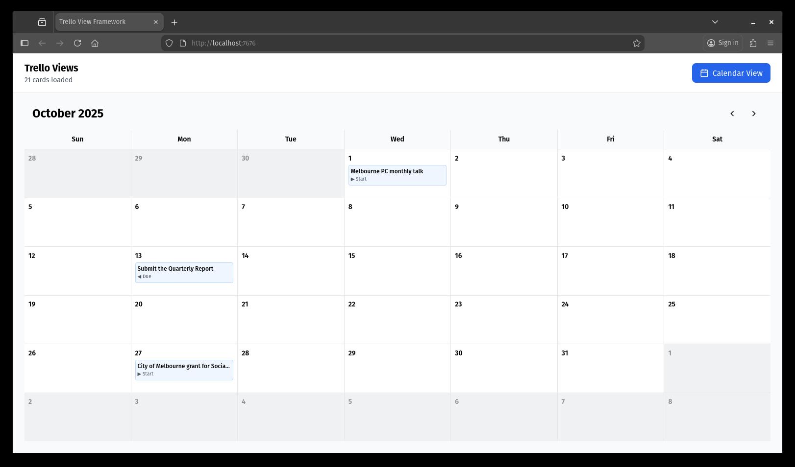

# trello-views

Utilises Trello JSON export (available on free plans), to create custom views locally.

The benefits:
- Unlock features that otherwise are only available on paid/team accounts.
- Privacy around the usage of the cards.
- Exposing to public.
- Exporting to other format.
- Applying dictionary vocabulary.



## Usage

1. Obtain JSON export on Trello:
Go to the board;
top right "..." menu;
"Print, export and share";
"Export as JSON"

2. Very simple. Serve the project locally, let's say on port 7676:
```bash
$ git clone https://github.com/pendashteh/trello-views.git
$ cd trello-views
$ busybox httpd -f -p 7676
```
Now, open [http://localhost:7676](http://localhost:7676) and upload the JSON file.

## Available views

For now, there is only Calendar View available.

## To do

Provide a modular mechanism to add more views and ultimately allow for a marketplace.

## Credit
Code, not this README, done by Claude Sonnet 4.5
Source available on https://github.com/pendashteh/trello-views
Copyleft license, no warranty, use as pleased.
