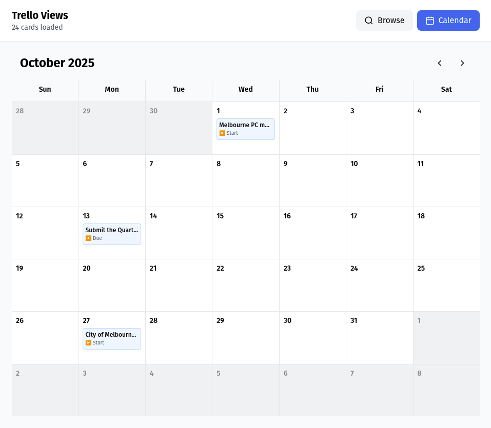
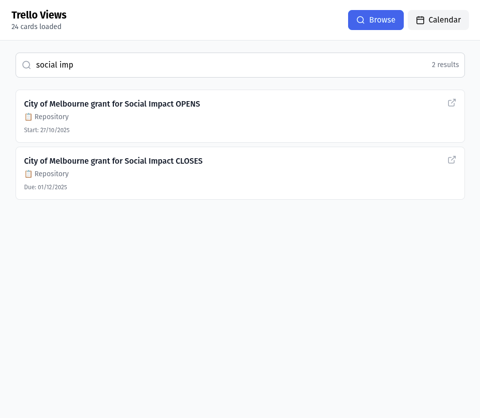

# trello-views

Utilises Trello JSON export (available on free plans), to create custom views locally.

The benefits:
- Unlock features that otherwise are only available on paid/team accounts.
- Privacy around the usage of the cards.
- Exposing to public.
- Exporting to other format.
- Applying dictionary vocabulary.

Calendar View:



Browse View:



## Usage

1. Obtain JSON export on Trello:
Go to the board;
top right "..." menu;
"Print, export and share";
"Export as JSON"

2. Very simple. Serve the project locally, let's say on port 7676:
```bash
$ git clone https://github.com/pendashteh/trello-views.git
$ cd trello-views
$ busybox httpd -f -p 7676
```
Now, open [http://localhost:7676](http://localhost:7676) and upload the JSON file.

## Managing Data Sources

### Local Board Files

1. **Place your Trello exports in `data/` directory:**
```bash
cp ~/Downloads/my-board.json data/personal.trello.json
cp ~/Downloads/work-board.json data/work.trello.json
```

2. **Update the index:**
```bash
./update-data.sh
```

This creates `data/index.txt` listing all `.trello.json` files.

3. **Reload the app** - it will auto-detect boards on startup, or click "Scan ./data/" in Settings.

**Important:** Run `./update-data.sh` whenever you add/remove board files in the `data/` directory.

### Settings Panel

Click the ⚙️ Settings icon in the header to:

- **Upload JSON files** - Add boards from your computer
- **Scan ./data/** - Detect `.trello.json` files in the data directory
- **Enable/disable sources** - Check/uncheck boards to include them
- **Remove sources** - Delete uploaded sources (local files remain)

### Data Source Types

- **Local files** (📁) - Files from `./data/` directory
- **Uploaded files** (📤) - Files uploaded through the UI

Settings are saved in browser localStorage and persist across sessions.

### Multi-Board Views

When multiple sources are enabled, all cards are merged into a single view. This lets you:

- See all your cards across different boards
- Search across multiple projects
- View combined calendars

## To do

Provide a modular mechanism to add more views and ultimately allow for a marketplace.

## Credit
Code, not this README, done by Claude Sonnet 4.5
Source available on https://github.com/pendashteh/trello-views
Copyleft license, no warranty, use as pleased.
